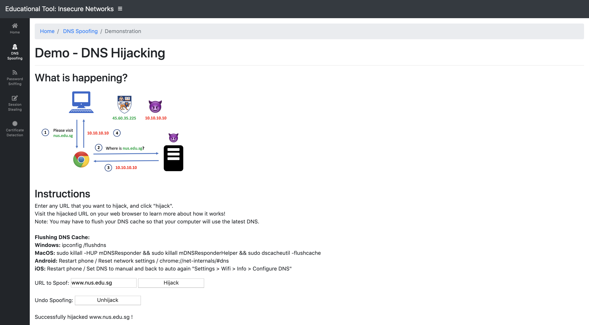
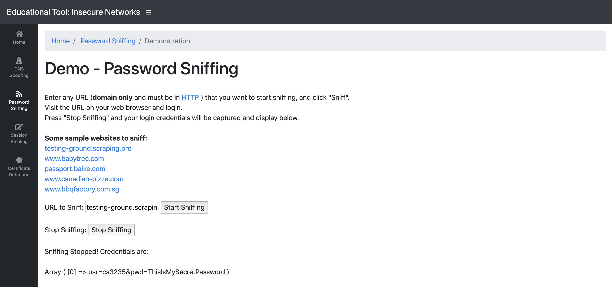
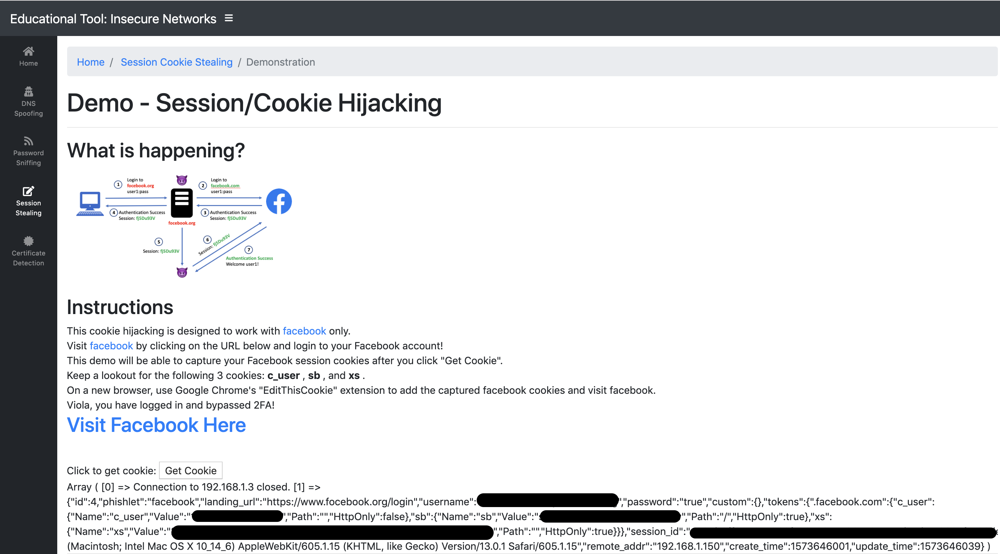
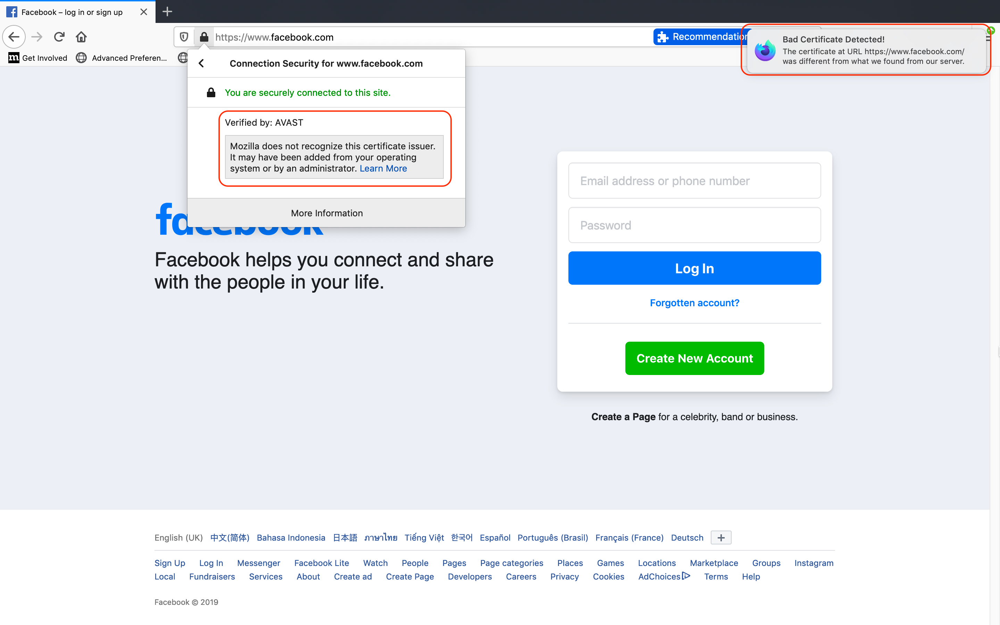
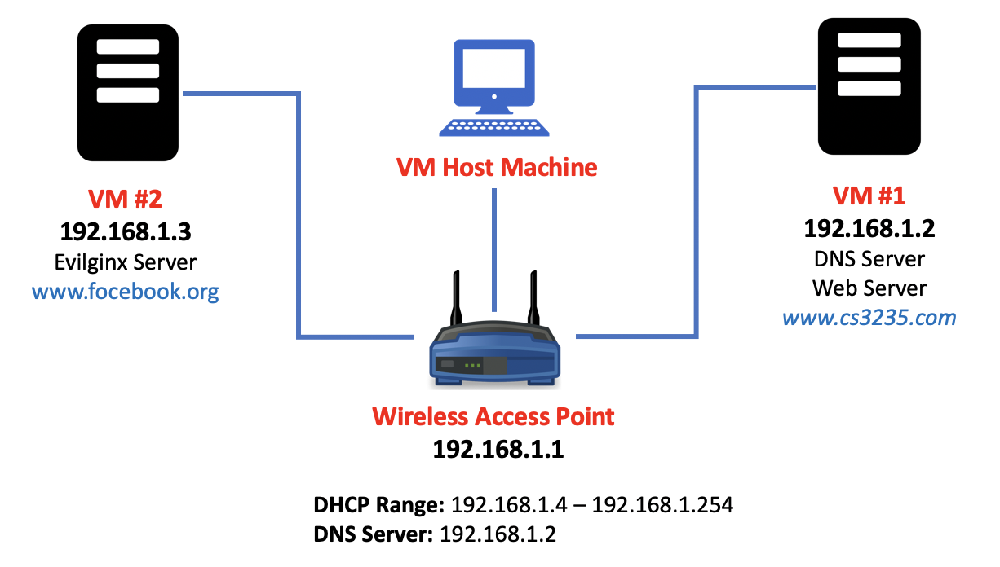

== Educational Tool and Detection of Network-Based Attacks on Insecure Network

=== About Us

This is a group project for NUS CS3235 - Computer Security module.

. Group Members:
* https://github.com/TerenceTanWT[Terence Tan]
* https://github.com/kzzhang[Kevin Zhang]
* https://github.com/Pearlissa[Pearlissa]
* https://github.com/GilgameshTC[Travis]
* Chong Hong Yun

=== Introduction

As the world is becoming more interconnected through the Internet, there have been an increase in various network-based attacks. Therefore, we created a web-based educational tool that will allow users to learn the various network-based attacks through a series of hands-on technical demonstration through our intuitive website, without the need of complex tools. As the solution to most network based attacks demonstrated in our educational website can be prevented with SSL, we developed a web extension to help detect SSL hijacking as SSL is also prone to attack. We believe that our web based hands-on demonstration will keep users engaged and allow them to learn better than any traditional books or lectures.

=== Sample Screenshots

.DNS Spoofing Demo
 

{nbsp} +

.Password Sniffing Demo

{nbsp} +

.Session Hijacking Demo

{nbsp} +

.Firefox Extension to Detect SSL Hijacking

{nbsp} +

=== Setting Up of Educational Web Tool

.Network Diagram

. Setup a wireless access point (AP) with Internet access, DHCP range of 192.168.1.4 to 192.168.1.254, and DNS server 192.168.1.2. Connect your computer to the Wi-Fi.

. Download VM #1 and #2 https://drive.google.com/drive/folders/1MsDX6YMXppoOnNtAmv1S6OdW-XFF_Y6h?usp=sharing[here].

. Import both VMs into VirtualBox (tested on v6.0) and set the both network adapters to bridge mode so that they can obtain IP address directly from the AP.

. Launch both VMs and configure static IP address of VM #1 to 192.168.1.2 and VM #2 to 192.168.1.3. Configure both DNS to 192.168.1.2. Restart both VMs.

. Visit www.cs3235.com from the computer while connected to the Wi-Fi. Start using the educational tool!

=== Setting Up of SSL Hijacking Firefox Extension

Please visit https://github.com/kzzhang/firefox_certificate_checker[here] for the instructions.

=== Credits

https://github.com/kgretzky/evilginx2[Evilginx2] for session hijacking.

